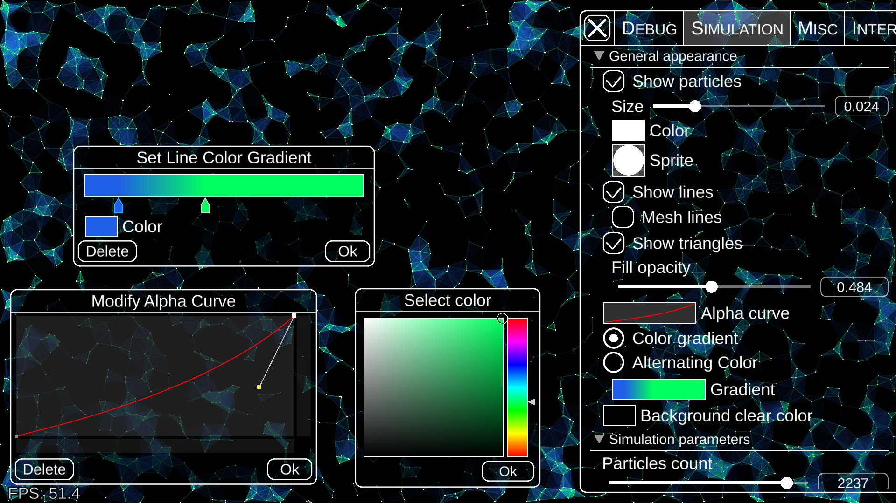
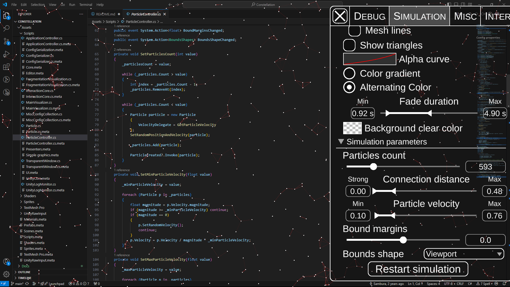

# Constellation

My personal fun Unity project. Constellation is a program that visualizes a simple particle simulation, and its main goal is to produce beautiful visualization. The visualization is highly configurable, and can produce various amazing results. I doubt there are any practical applications of this program, so its purpose is to just be aesthetically pleasing. 

**Basic simulation in Constellation**


## Features

* Simulation of particles: each particle travels at a constant velocity in a constant direction until it hits the bound, at which point it randomly changes direction and velocity. Number of particles, velocity bounds, color, size and other parameters are configurable;
* Drawing lines: if two particles come close enough, a line will be displayed. Opacity and color of the line can change depending on the distance;
* Drawing triangles: if three particles are in the close proximity, a triangle can be drawn with particles being the vertices;
* Interaction: several modes of interaction with particles are implemented, e.g., attraction of particles to the mouse cursor;
* Displaying debug information: visualize simulation fragmentation and bounds;
* Saving configurations: you can save the configuration of the simulation and visualization to load it in the program later;
* Transparent mode: Constellation can function as an overlay, allowing you to work on your PC while displaying the simulation on top (Windows only);
* Built-in benchmarks: set up the simulation and capture frame timings using in-game UI to see and export performance report.

**Constellation settings view**

**Another example of Constellation simulation**

**Transparent mode**


You can find more screenshots in [screenshots directory](Docs/Screenshots/)

## Interesting points

* The project is done almost entirely by me, with very little 3rd party code (excluding TextMeshPro and UnityRawInput packages, and possibly small code snippets in other scripts);
* One of my main goals in this project is to eventually achieve the highest performance possible with simulations. I am still experimenting with various approaches to both simulation and visualization to maximize performance, which is also why I decided to implement a built-in benchmark tool; 
* Currently simulation is rendered using low level Unity rendering API (UnityEngine.GL), since it showed best performance so far, although the rendering can potentially be further improved in the future if I find better alternatives;
* For this project I have developed a whole framework for automatic script properties serialization as in-game UI. As such, the UI displayed in the settings is entirely automatically generated (dialogs excluded). Examples of automatically serialized property in the script:

    ```C#
    public class ExampleClass : MonoBehaviour {
        [ConfigProperty] public bool BoolValue { get; set; }
        [ConfigProperty] public float FloatValue { get; set; }
        [SliderProperty(minSliderValue: -10 maxSliderValue: 10, name: "Displayed name")] public float RangeOfValues { get; set; }

        [InvokableMethod]
        public void PressMe() { /***/ }
    }
    ```
    This example would generate a checkbox for the first property, a default slider for the second one, customized slider for the third, and a button for the `PressMe()` method. For the best result it is required to manually create event that triggers when the value of a property is changed;
* Besides the UI auto-serialization, I also implemented a custom JSON serializer/deserializer (based on Unity's implementation), my own rendering API (wrapper around `UnityEngine.GL`), as well as an extensive UI kit (based on Unity's default UI elements).

## Other

* Unity editor version: 6000.0.47f1
* Platforms available: Only tested on Windows 10/11. Might be possible to run on non-windows systems, except for transparent mode feature
